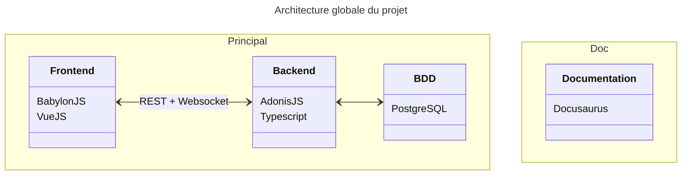

La conception de l'architecture de notre projet est une étape cruciale. Celle-ci doit être pensée pour répondre à nos besoins actuels, mais aussi pouvoir évoluer pour nous permettre de réagir facilement aux changements que nous pourrions rencontrer. Découvrez dans cet article les choix que nous avons faits pour notre projet Golden Legends.
<!-- truncate -->

## 🏗️ Conception
Après avoir discuté avec Théo et Nicolas, et de par leur expérience avec BabylonJS sur [leur projet de l'an dernier](https://github.com/gamesonweb/be-green-daily-green), nous avons décidé de construire notre projet de façon à pouvoir travailler en parallèle sur les différentes tâches.
Je vais vous présenter l'architecture en expliquant les raisons pour lesquelles nous avons choisies certaines technologies par rapport à d'autres.

Vous pouvez retrouver l'ensemble du code sur notre [organisation GitHub](https://github.com/Golden-Legends). Nous avons 3 répositories principaux :
- [Frontend](https://github.com/Golden-Legends/golden-legends)
- [Backend](https://github.com/Golden-Legends/golden-legends-back)
- [Documentation](https://github.com/Golden-Legends/golden-legends-docs)
### 🖥️ Frontend
Nous avons décidé d'ajouter un frakework web frontend : VueJS. C'est une technologie que je connais bien et qui permet de créer des interfaces utilisateurs de façon rapide et efficace. Rien de personnel contre React et Angular qui sont également très puissants, question de préférences ici.\

### 🏭 Backend
Côté Backend, nous n'avions de l'expérience qu'avec Spring Boot. Bien que celui-ci soit très performant et aurait très bien pu correspondre à nos besoins, nous avons décidé de nous tourner vers [AdonisJS](https://adonisjs.com/).

Après être monté en compétence dessus via un projet personnel, j'ai été convaincu par ce framework. Il est très complet et permet de rester dans l'écosystème Javascript/Typescript. De plus, il est très bien documenté et dispose d'une communauté active qui pourra nous aider si nous rencontrons des difficultés.

### ↔️ Communications
Pour la communication entre le Frontend et le Backend, nous avons choisi d'utiliser une architecture REST pour les requêtes classiques. À ce jour, nous commenceons à mettre en place des websockets pour les communications en temps réel qui serviront pour.... le **mode multijoueur** !

### 📚 Documentation
Pour la documentation (et le blog...), nous avons choisi d'utiliser [Docusaurus](https://docusaurus.io/). C'est un outil qui permet de créer des sites statiques à partir de fichiers Markdown. Cela nous permettra de documenter notre projet de façon claire et efficace.
